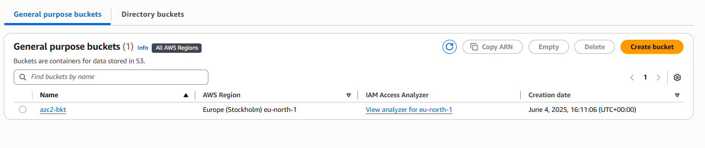
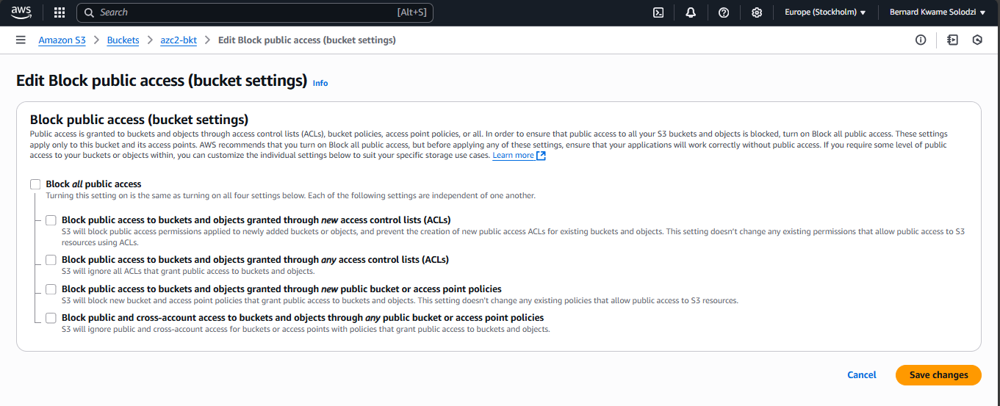
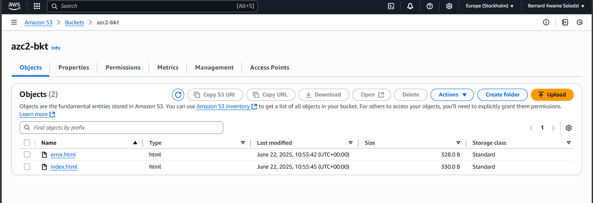
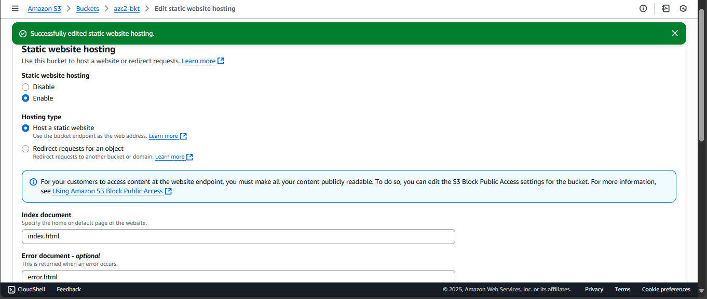
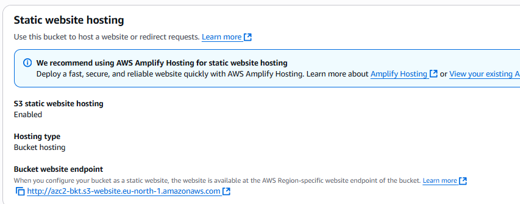
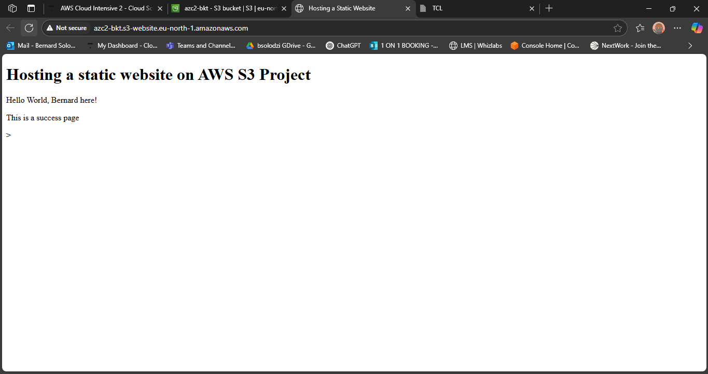

# Hosting a Static Website on AWS S3

_Author: Bernard Kwame Solodzi  
Date: 2025-06-25_

---

## Introduction

In this project, I learnt how to host a static website using Amazon S3. This documentation covers all the necessary steps, from creating an S3 bucket to configuring permissions and finally accessing the website online. This will serve as a guideline for anyone looking to replicate this project.

---

## Table of Contents

1. [Introduction](#introduction)
2. [Prerequisites](#prerequisites)
3. [Step 1: Create an S3 Bucket](#step-1-create-an-s3-bucket)
4. [Step 2: Upload Website Files](#step-2-upload-website-files)
5. [Step 3: Configure Bucket for Static Website Hosting](#step-3-configure-bucket-for-static-website-hosting)
6. [Step 4: Set Bucket Permissions](#step-4-set-bucket-permissions)
7. [Step 5: Access Your Website](#step-5-access-your-website)
8. [Conclusion](#conclusion)
9. [References](#references)

---

## Prerequisites

- An AWS account ([Sign up here](https://aws.amazon.com/))
- Basic knowledge of HTML/CSS/JS
- Website files(`index.html` & `error.html`) ready to upload
  ### Content of `index.html`
  ```json
  <!DOCTYPE html>
  <html>
  <head>
      <meta charset='utf-8'>
      <meta http-equiv='X-UA-Compatible' content='IE=edge'>
      <title>Hosting a Static Website</title>
  </head>
  <body>
      <h1>Hosting a static website on AWS S3 Project</h1>
      <p>This is a success page</p>
  </body>
  </html>
  ```
  ### Content of `error.html`
  ```json
  <!DOCTYPE html>
  <html>
  <head>
      <meta charset='utf-8'>
      <meta http-equiv='X-UA-Compatible' content='IE=edge'>
      <title>Hosting a Static Website</title>
  </head>
  <body>
      <h1>Hosting a static website on AWS S3 Project</h1>
      <p>This is an error page</p>
  </body>
  </html>
  ```

---
Follow the steps to finish the task

## Step 1: Create an S3 Bucket

1. Log in to the [AWS Management Console](https://console.aws.amazon.com/).
2. Navigate to **S3** by searching s3.
3. Click **Create bucket**.
4. Enter a unique bucket name (e.g., `my-static-website`).
5. Select a region.
6. Leave the default settings
8. Click **Create bucket**.


9. In the Permissions tab, uncheck Block All Public Access and click **Save changes**
 > This is vital to allow public access to the content of our bucket (website files) over the internet. 




---

## Step 2: Upload Website Files

1. Open your new bucket.
2. Click **Upload**.
3. Add your website files i.e. `index.html`& `styles.css`.
4. Click **Upload**.



---

## Step 3: Configure Bucket for Static Website Hosting

1. Go to the **Properties** tab.
2. Scroll to **Static website hosting**.
3. Click **Edit**.
4. Enable static website hosting.
5. Enter `index.html` as the index document.
6. (Optional) Enter `error.html` as the error document.
7. Click **Save changes**.



---

## Step 4: Set Bucket Permissions

1. Go to the **Permissions** tab.
2. Click **Bucket policy**.
3. Add the following policy to allow public read access:

```json
{
  "Version": "2012-10-17",
  "Statement": [
    {
      "Sid": "PublicReadGetObject",
      "Effect": "Allow",
      "Principal": "*",
      "Action": "s3:GetObject",
      "Resource": "arn:aws:s3:::your-bucket-name/*"
    }
  ]
}
```
_Replace `your-bucket-name` with your actual bucket name._

4. Click **Save**.

---

## Step 5: Access Your Website

- Go back to the **Properties** tab.
- Under **Static website hosting**, copy the **Bucket website endpoint** URL.


  
- Paste it into your browser to view your website. It should show something similar to this.



---

## Conclusion

You have successfully hosted a static website on AWS S3! You can now share your website link with others.

---

## References

- [AWS S3 Static Website Hosting Documentation](https://docs.aws.amazon.com/AmazonS3/latest/userguide/WebsiteHosting.html)
- [AWS Free Tier](https://aws.amazon.com/free/)

---

<!-- To attach images, use:
